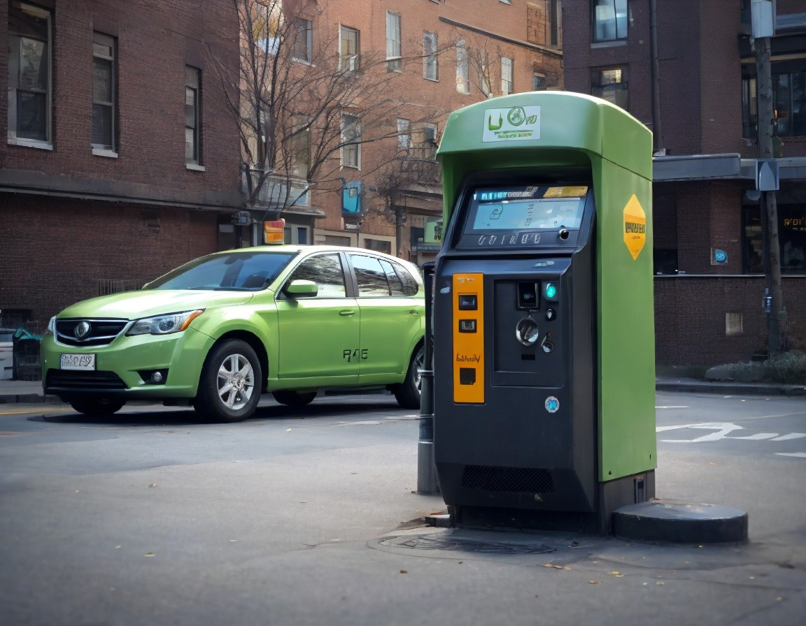

<!-- PROJECT LOGO -->
<br />
<div align="center">
  <a href="img/parking-meter.jpg">
    
  </a>

<h3 align="center">Stopcar</h3>

  <p align="center">
    Stopcar
    <br />
  </p>
</div>

<!-- ABOUT THE PROJECT -->
## Sobre o projeto

O STOPCAR é um software desenvolvido para gerenciar sistemas de parquímetros de forma eficiente e conveniente. Este software oferece uma solução moderna e completa para controle de estacionamento urbano, permitindo que os usuários paguem pelo tempo de estacionamento de maneira fácil e segura.

## GitHub
https://github.com/postechfiapgrupo04/stopcar

### Tecnologias
* Spring Boot - Framework Java para criação de aplicações web, rápido e fácil de configurar. Deveria ser usado para agilizar o desenvolvimento de aplicações Java. 
* MongoDB - Banco de dados NoSQL escalável, flexível e de alta performance. Deveria ser usado para aplicações que necessitam de um banco de dados não relacional.
* Maven - Gerenciador de dependências e build em Java. Deveria ser usado para gerenciar as dependências e automatizar o processo de build de um projeto.
* Caffeine Cache - Biblioteca de caching eficiente para aplicações Java. Deveria ser usado para melhorar a performance de consultas repetitivas em aplicações.
* Docker - Plataforma para criação, implantação e execução de aplicações em contêineres. Deveria ser usado para facilitar a distribuição e implantação de aplicações em diferentes ambientes.


<!-- GETTING STARTED -->
## Getting Started

O seguintes passos descrevem como clonar o projeto, rodar e também construir a imagem para contribuir com o desenvolvimento.

### Pré-requisitos

É necessario ter instalado java versão a partir da 17, Maven, Docker.

### Instalação
1. Clone o repositório
   ```
   git clone https://github.com/postechfiapgrupo04/stopcar.git
   ```
2. Rodando aplicação, navegue até a pasta raiz
   ```
   docker compose up
   ```
3. Navegue para o endereco
   ```
   http://localhost:8080/swagger-ui/index.html#/
   ```
### Contribuição
Pensando em facilitar a contribuição com este software estamos utilizando o docker-file-maven-plugin que automatiza o empacotamento e construção da imagem docker.
1. Realizando empacotamento e build da imagem
   ```
   ./mvnw package -Pprofile-docker -f pom.xml
   
obs: Caso queira seguir o procedimento padrao de construção da imagem docker basta não informar o seguinte parametro: -Pprofile-docker 
<!-- USAGE EXAMPLES -->
## Usando
Para utilizar a nossa API basta subir a aplicacão e seguir para o passo 3 do topico de Instalação. Pois a mesma dispõe de [documentão](http://localhost:8080/swagger-ui/index.html#/) ampla através do OpenApi Documentation, mas segue também a coleção que está dentro da pasta \stopcar\collection-api para o uso em ferrametas de teste de API.

<!-- CONTRIBUTING -->
## Contribuindo

Se você tiver uma sugestão que possa melhorar isso, bifurque o repositório e crie uma solicitação pull. Você também pode simplesmente abrir um problema com a tag “enhancement”. Não se esqueça de dar uma estrela ao projeto! Obrigado novamente!

1. Fork the Project
2. Create your Feature Branch (`git checkout -b feature/AmazingFeature`)
3. Commit your Changes (`git commit -m 'Add some AmazingFeature'`)
4. Push to the Branch (`git push origin feature/AmazingFeature`)
5. Open a Pull Request

## Observações

Alguns payloads no Swagger não estão atualizados.
Para fazer o POST e criar uma nova reserva, use o seguinte modelo: 
```json
{
    "car": {
        "model": "Civic",
        "plate": "123abc",
        "type": "SEDAN"
    },
    "location": "Av. Paulista, 123",
    "startDate": "2024-03-08T20:56:00",
    "totalHours": 2,
    "payment": {
        "type": "CREDIT_CARD"
    }
}
```

## Dificuldades

### Entender como mudar o Time Zone no Docker:
Solução alterar o Docker Composer.
  
<!-- CONTACT -->
## Contato

- Milton Willamis da Silva - milton.willamis.silva@gmail.com
- Bruno Eduardo Martins Rosselli - bruno.rosselli@hotmail.com
- Bruno Araújo - brunosousa357@gmail.com

Project Link: [https://github.com/postechfiapgrupo04/stopcar](https://github.com/postechfiapgrupo04/stopcar)

<!-- ACKNOWLEDGMENTS -->

